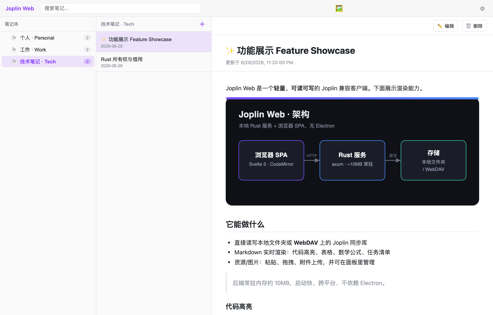
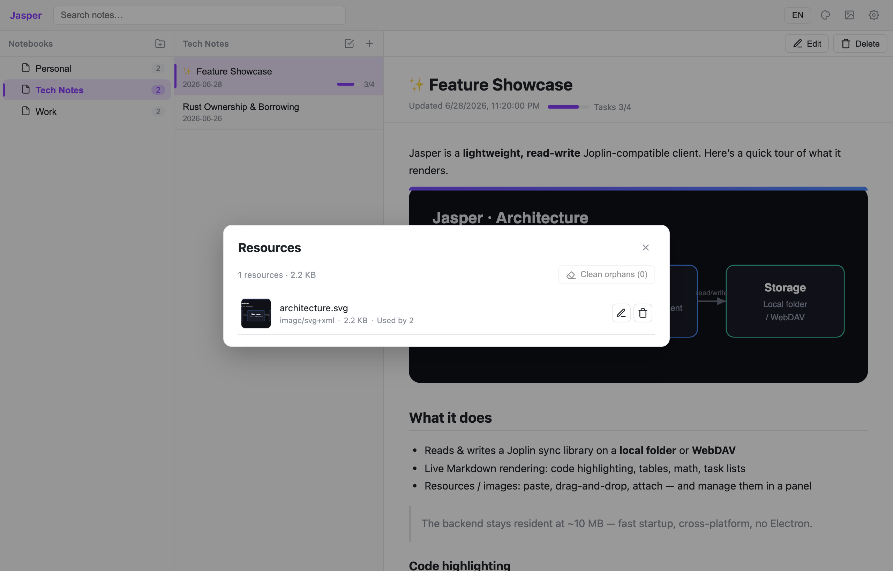
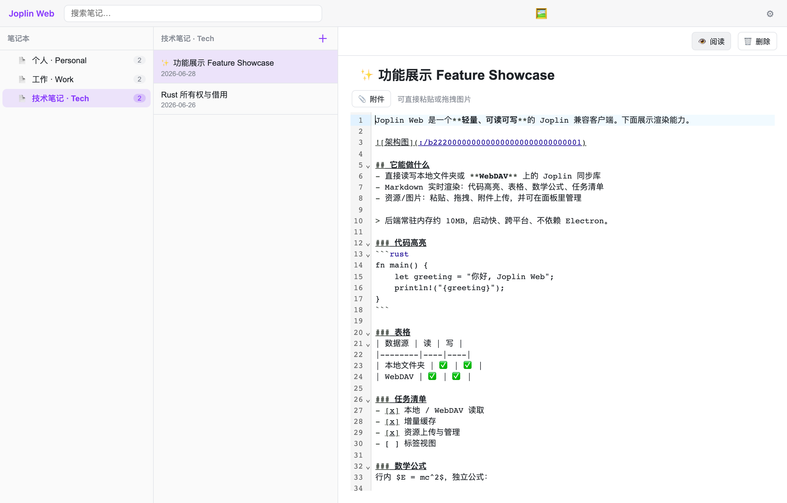
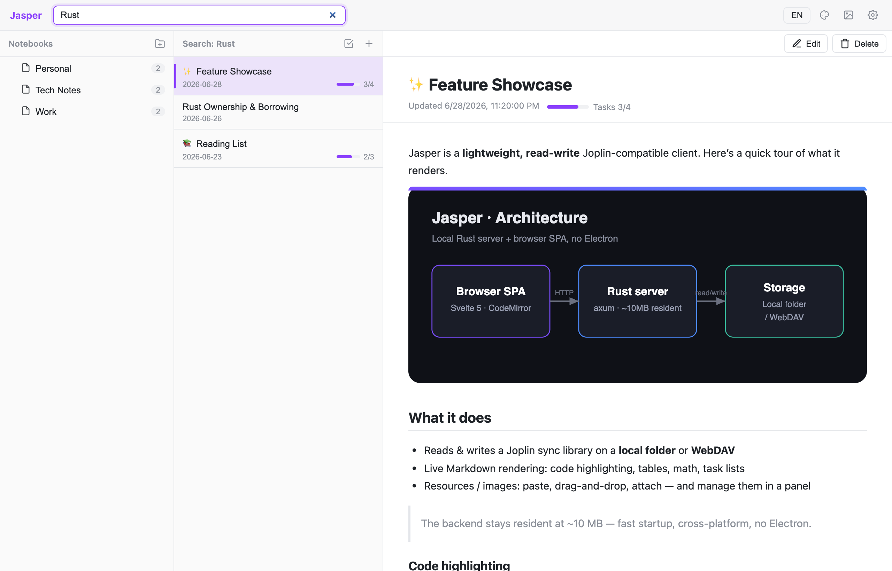
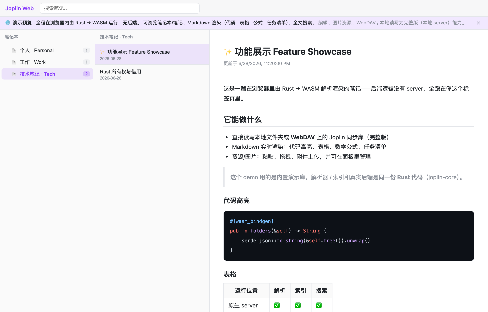

# Joplin Web

[English](README.md) · **中文**

[](https://github.com/xVanTuring/joplin-web/actions/workflows/pages.yml)

> 🌐 **在线 demo（全程在浏览器内由 WASM 运行，无后端）：** https://xvanturing.github.io/joplin-web/

一个轻量、**可读可写**的 [Joplin](https://joplinapp.org/) 兼容客户端：**本地 Rust (axum) 服务 + 浏览器 SPA**，不依赖 Electron / Tauri / WebView。直接读写你已有的 Joplin 同步库，改动会被 Joplin 下次同步自动拾取。



## 为什么

- **小而快** —— 后端常驻内存约 10 MB，几乎瞬时启动，没有 200 MB 的 Electron 运行时。
- **跨平台** —— macOS / Windows / Linux 单个二进制，界面就是一个浏览器标签页。
- **数据即文件** —— 直接操作 Joplin 同步格式（`<id>.md` 条目 + `.resource/` 二进制），不把数据锁进新数据库。

## 功能

### 📂 读写真实的 Joplin 库
- 数据源：**本地文件夹** 或 **WebDAV**（Nextcloud 等）。
- 三栏界面：笔记本树（嵌套 + 篇数） · 笔记列表 · 阅读/编辑。
- 按标题与正文全文搜索。
- 可新建空库，也可连接现有库 —— 首次启动由向导引导；随时可在 ⚙ 切换数据源。

### ✍️ 编辑
- **双编辑模式，一键切换**（像 Joplin）：**所见即所得**富文本编辑器（Milkdown / Crepe）与 **Markdown 源码**编辑器（CodeMirror 6）。默认富文本，选择会被记住；两者都懒加载、不拖慢首屏。
- 输入即**自动保存**；支持新建 / 修改 / 删除笔记。**仅打开或切到富文本不会自动保存**，只有真正编辑才写回。
- 源码模式按字节无损保留；富文本保存时会**整篇重排** Markdown（往返固有取舍），但 Joplin `:/id` 资源链接始终保留。HTML 笔记一律走源码模式。
- 写回时**逐字保留**所有元数据字段、只刷新时间戳 —— diff 最小，对 Joplin 的冲突处理友好。

### 🎨 富 Markdown 渲染
- 代码高亮、表格、任务清单、引用块。
- **数学公式**（KaTeX，行内 `$…$` 与独立 `$$…$$`）。
- 通过 Joplin 的 `:/资源id` 链接内嵌图片与附件。
- HTML 笔记经 DOMPurify 净化后原样显示。

### 🖼️ 资源与图片上传
- 在编辑器里**粘贴**、**拖拽**，或点 **📎 附件** 按钮 —— 文件作为 Joplin 资源上传，并在光标处插入 `:/id` 引用。
- **资源管理**面板（顶栏 🖼）：缩略图、类型与大小、**引用计数**、重命名、删除，以及对无人引用资源的**一键清理孤儿**。



### ⚡ 增量缓存
- 本地 SQLite 缓存按数据源记录每个条目的内容与修改时间。
- 启动时只拉取**新增或变化**的条目 —— WebDAV 场景下第二次启动对未变笔记发起**零次** `GET`，仅一次目录列举。

### 📝 编辑 & 🔎 搜索

| 编辑（粘贴 / 拖拽 / 附件） | 全文搜索 |
| --- | --- |
|  |  |

## 快速开始

### 源码运行

```bash
# 后端 —— 在 http://127.0.0.1:27583 提供 API 并托管前端
cd server && cargo run                       # 读已保存配置，或进入向导
cd server && cargo run -- /路径/JoplinDir     # 用本地文件夹引导
cd server && cargo run -- https://host/dav/   # 或一个 WebDAV 地址

# 前端
cd web && pnpm install
cd web && pnpm build      # 产出 web/dist，由后端在 :27583 托管
cd web && pnpm dev        # 或开发热更新(:5173，/api 代理到后端)
```

然后打开 **http://127.0.0.1:27583/**。首次启动可在向导里选择 *现有库* / *新建库* × *本地* / *WebDAV*。

### 单文件打包

前端可经 [rust-embed](https://crates.io/crates/rust-embed) **编译进二进制**，整个应用就是一个自带前端的可执行文件 —— 运行时不再需要 `web/dist`：

```bash
cd web && pnpm build                                  # 先构建出 web/dist
cd server && cargo build --release --features embed    # → server/target/release/joplin-lite（约 5 MB）
```

把这个文件拷到任意位置直接运行即可。`embed` 是可选 feature；不带它时后端照旧从磁盘 `web/dist` 托管（所以不构建前端也能直接 `cargo run`）。

### Docker

```bash
docker compose up --build   # 然后访问 http://localhost:27583/
```

镜像是 `debian-slim` 上的单个内嵌二进制（前端已打进去）。配置目录挂载为数据卷，数据源设置与缓存会持久化。

#### 从 GHCR 拉取预构建镜像

推送会由 [`.github/workflows/docker.yml`](.github/workflows/docker.yml) 构建并发布到 GitHub Container Registry：

```bash
docker run -p 27583:27583 -v joplin-config:/config \
  ghcr.io/<owner>/joplin-lite:latest      # 然后访问 http://localhost:27583/
```

`main` 构建 `latest`（+ `sha-…`）；版本 tag（`v1.2.3`）打语义化版本标签。

### 用演示内容试一试

`docs/gen-demo-library.py` 会生成一个小型示例库（即这些截图所用）：

```bash
python3 docs/gen-demo-library.py /tmp/joplin-demo
cd server && cargo run -- /tmp/joplin-demo
```

### 浏览器 demo（WASM，无 server）

核心逻辑（数据模型 / 解析 / 序列化 / 索引）抽成了依赖很轻的 `joplin-core` crate，它也能编译到 WebAssembly。配上内置的演示库，就能做一个**只读、零服务器**的预览——整页跑在浏览器标签里，适合做静态演示站（如 GitHub Pages）。

```bash
# 需先装：rustup target add wasm32-unknown-unknown + wasm-pack
cd web && pnpm build:demo   # 先编 wasm，再产出静态 demo 到 web/dist
```

不影响原生构建：非 demo 模式下 wasm import 会被整体 tree-shake 掉。



## 工作原理

```
浏览器 SPA (Svelte 5 + CodeMirror)  ──HTTP──▶  Rust 服务 (axum)  ──读写──▶  本地文件夹 / WebDAV
```

服务扫描同步目录，把每个 `<id>.md` 条目解析进内存索引，对外暴露一组精简 JSON API（`/api/folders`、`/api/notes`、`/api/resources`、`/api/search` 等）。前端在浏览器侧渲染 Markdown，并把 `:/id` 资源链接改写为 `/api/resources/id`。

## 兼容性与限制

- 面向 **Joplin v3.x 同步格式**（同步目标版本 3）、**未加密**的库。
- 处理笔记、笔记本、资源、标签、note-tag；修订(revisions) 等内部类型跳过。
- 本客户端**不参与** Joplin 的同步锁协议 —— 个人使用足够；若两端同时改同一篇，Joplin 会照常生成冲突副本。
- 暂无鉴权 —— 默认绑定 `127.0.0.1`；若要暴露到局域网，请自行加一层鉴权。
- WebDAV 密码以**明文**存于本地配置库。

## 技术栈

Rust · axum · rusqlite · rayon · ureq —— Svelte 5 (runes) · Vite · TypeScript · CodeMirror 6 · markdown-it · KaTeX · highlight.js · DOMPurify。
